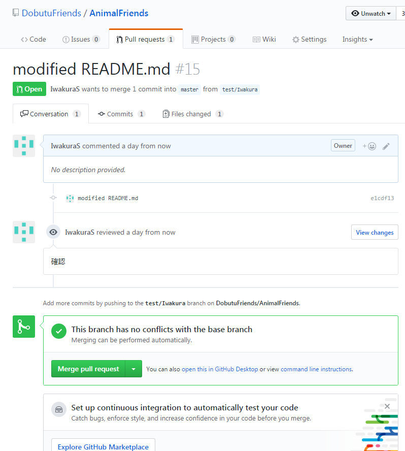

# Git操作（トラブルシューティング）

Gitメモに使うファイル。  
みんなで好きに書き足していこう.  
時間があったらじょじょに書き足していくスタイルで、  
とりあえず貼り付けておくのも可。  

<details>
  <summary>テンプレート例</summary>
  ...
</details>

<details>
  <summary>Git初期操作メモ</summary>

```
Git登録情報
　ユーザ名：IwakuraS
　メール：c011206342@edu.teu.ac.jp
 
上記のユーザーが新規に「test/Iwakura」ブランチを作成し、
作業を行い
「master」に反映させるまで。

```

```
操作：GitBash

■環境設定
$ git config --global user.name "IwakuraS"
$ git config --global user.email "c011206342@edu.teu.ac.jp"
$ git config --global core.quotepath false
$ git config --global gui.encoding utf-8

$ pwd
/c/Users/IW
$ cd /c
$ pwd
/c

■/c直下にクローン＝リモートリポジトリのAnimalFriendsをフォルダを作成
$ git clone https://github.com/DobutuFriends/AnimalFriends.git  
Cloning into 'AnimalFriends'...
remote: Counting objects: 424, done.
remote: Compressing objects: 100% (4/4), done.
remote: Total 424 (delta 0), reused 2 (delta 0), pack-reused 420
Receiving objects: 100% (424/424), 360.04 KiB | 427.00 KiB/s, done.
Resolving deltas: 100% (210/210), done.

$ cd AnimalFriends/
$ ls
AnimalFriends/  README.md  work/
$ cd work/
$ ls
kakiwork/  kuma/  Leki/  Musasin/  nemonemo/  README.md  test.txt
$ mkdir Iwakura
$ ls
Iwakura/  kakiwork/  kuma/  Leki/  Musasin/  nemonemo/  README.md  test.txt

■新規ブランチ作成し、移動（作成する場合オプション「-b」）
$ git checkout -b "test/Iwakura"
Switched to a new branch 'test/Iwakura'
$ git branch -a
  master
* test/Iwakura
  remotes/origin/HEAD -> origin/master
  remotes/origin/feature/clean_gomi
  remotes/origin/kuma_work
  remotes/origin/master
  remotes/origin/test/Kuma
  remotes/origin/test/hiroshi
  remotes/origin/test/kaki


$ git status
On branch test/Iwakura
nothing to commit, working tree clean

■新規ファイル作成
$ vi Iwakura/README.md
$ git status
On branch test/Iwakura
Untracked files:
  (use "git add <file>..." to include in what will be committed)

        Iwakura/

nothing added to commit but untracked files present (use "git add" to track)

■リモートリポジトリに反映させたいファイルをadd
$ git add Iwakura/README.md
$ git status
On branch test/Iwakura
Changes to be committed:
  (use "git reset HEAD <file>..." to unstage)

        new file:   Iwakura/README.md

■addしたファイル分の変更を記録するコミット
$ git commit -m "commit"
[test/Iwakura b6adefb] commit
 1 file changed, 1 insertion(+)
 create mode 100644 work/Iwakura/README.md

$ git status
On branch test/Iwakura
nothing to commit, working tree clean
$ git log
commit b6adefbd6bc8c30e713fad8284e13a840d678292 (HEAD -> test/Iwakura)
Author: IwakuraS <c011206342@edu.teu.ac.jp>
Date:   Sat Jun 3 15:55:25 2017 +0900

    commit

commit 00313f87c7714d4b134fe6d8cbc71fecc0bdeff0 (origin/master, origin/HEAD, mas                                                                                                                                                                                               ter)
Merge: 452392d 4e02dc7
Author: Musasin <c0112051b9@edu.teu.ac.jp>
Date:   Sat Jun 3 16:01:47 2017 +0900

    Merge pull request #10 from DobutuFriends/test/Kuma

    Test/kuma

commit 452392de920dec1db4d487b8bc85d102eaa50de5
Merge: af3e078 1eeca7c
Author: Musasin <c0112051b9@edu.teu.ac.jp>
Date:   Sat Jun 3 16:01:38 2017 +0900

    Merge pull request #11 from DobutuFriends/test/kaki

■コミットを反映させる（originはローカルリポジトリ：下記はローカルリポジトリをリモートのtest/Iwakuraに反映）
$ git push origin test/Iwakura
Counting objects: 5, done.
Delta compression using up to 6 threads.
Compressing objects: 100% (3/3), done.
Writing objects: 100% (5/5), 387 bytes | 0 bytes/s, done.
Total 5 (delta 2), reused 0 (delta 0)
remote: Resolving deltas: 100% (2/2), completed with 2 local objects.
To https://github.com/DobutuFriends/AnimalFriends.git
 * [new branch]      test/Iwakura -> test/Iwakura

```

masterへ反映させる方法  
①と②の方法いずれか
  
①GitBash操作

```
$ git checkout master
Switched to branch 'master'
Your branch is up-to-date with 'origin/master'.

$ git branch -a
* master
  test/Iwakura
  remotes/origin/HEAD -> origin/master
  remotes/origin/feature/clean_gomi
  remotes/origin/kuma_work
  remotes/origin/master
  remotes/origin/test/Iwakura
  remotes/origin/test/Kuma
  remotes/origin/test/hiroshi
  remotes/origin/test/kaki

■mergeすることでmasterにtest/Iwakuraのコミットを取り込む
$ git merge test/Iwakura
Updating 00313f8..b6adefb
Fast-forward
 work/Iwakura/README.md | 1 +
 1 file changed, 1 insertion(+)
 create mode 100644 work/Iwakura/README.md

■pushすることで反映
$ git push origin


```
  
    
    
②Web操作

[Commit画面](https://github.com/DobutuFriends/AnimalFriends/commits/master)から反映させたいBranchを選択し、
コミットに表示されているpull requestを選択

レビューを行い、mergeできる。


＊時間があるときに追加説明加えていきます


</details>
